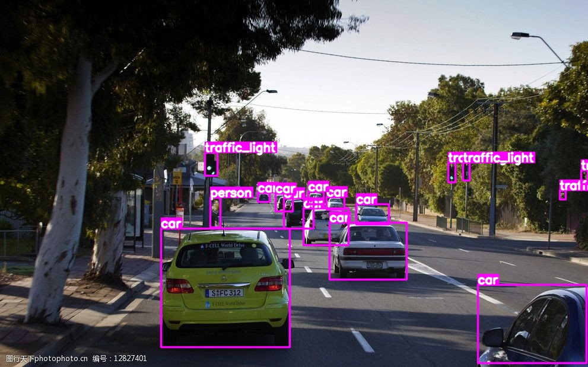
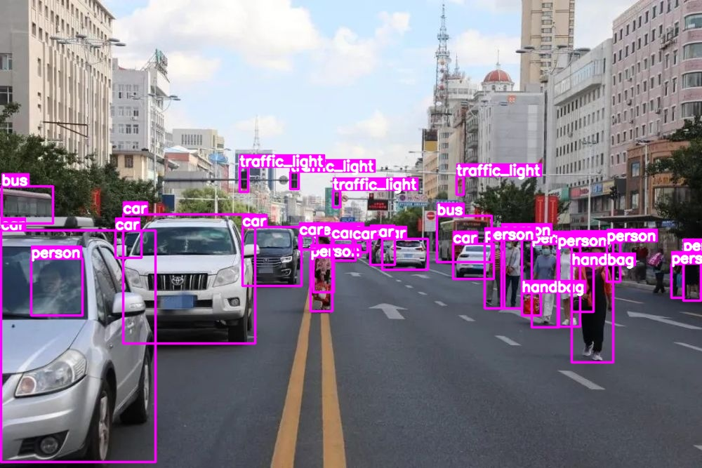

# Pack YOLO+TensorRT+Cuda as dynamic link library and call through Python 
[README中文版](https://github.com/emptysoal/YOLOv5-TensorRT-lib-Python/blob/main/README-chinese.md)

## Introduction

### Target

- The code of  YOLOv5 inferencing with TensorRT C++ api is packaged into a dynamic link library , then called through Python. 

**Reason:**

1. Optimizing the YOLO model using TensorRT C++ api can **significantly improve the speed of object detection**, but C++ code is not easy to extend to the network communication protocol interface ;
2. Python, as the most popular glue programming language, has **a lot of mature communication protocol libraries**, which can facilitate various network protocol communication and enable a variety of services; 

Therefore, if the C++ model inference code is compiled into a dynamic link library, and then encapsulate with Python, it has the advantage of reasoning speed and scalability 

​		Some people may ask **why not directly use TensorRT Python Api**, it seems that the same effect can be achieved, I believe that this project has the following advantages, better than directly using TensorRT Python Api :

1. When using the TensorRT Python Api, pre-processing and post-processing are done in Python, but also through numpy, and there is not much difference in speed ;
2. I use Cuda programming to speed up the preprocessing, improve the preprocessing speed, and then package it together into the dynamic link library for faster inference. 

### Outline

- Use TensorRT-v8.2 C++ api to speed up YOLOv5-v5.0 object detection; 
- Deploy on Linux x86 64;
- It is also feasible on Jetson series embedded devices, but the directories of header files and library files in CMakeLists.txt file in this project should be replaced.

**Core process**:

1. I encapsulated the code of YOLOv5 TensorRT inferencing into C++ class with the following key code: 

```c++
class YoloDetecter
{
public:
    YoloDetecter(const std::string trtFile, const int gpuId);
    ~YoloDetecter();
    float* inference(cv::Mat& img);
};
```

2. then I encapsulated the above code again using C-type functions, the key code is as follows :

```c++
#ifdef __cplusplus
extern "C" {
#endif

YoloDetecter* YoloDetecter_new(char* trtFile, int gpuId){
    return new YoloDetecter(std::string(trtFile), gpuId);
}

float* inference_one(YoloDetecter* instance, const uchar* srcImgData, const int srcH, const int srcW){
    cv::Mat srcImg(srcH, srcW, CV_8UC3);
    memcpy(srcImg.data, srcImgData, srcH * srcW * 3 * sizeof(uchar));
    return instance->inference(srcImg);
}

void destroy(YoloDetecter* instance) { delete instance; }

#ifdef __cplusplus
}
#endif
```

3. To generate the encapsulated code to the dynamic link library, the key sections in CMakeLists.txt are as follows :

```cmake
# ====== yolo infer shared lib ======
cuda_add_library(yolo_infer SHARED 
    ${PROJECT_SOURCE_DIR}/src/preprocess.cu 
    ${PROJECT_SOURCE_DIR}/src/yololayer.cu 
    ${PROJECT_SOURCE_DIR}/src/yolo_infer.cpp
    ${PROJECT_SOURCE_DIR}/main.cpp
)
target_link_libraries(yolo_infer nvinfer cudart ${OpenCV_LIBS})
```

4. Then I use Python to encapsulate a detection class, which calls the above C/C++ code, the key part of the code is as follows: 

```python
class YoloDetector:
    def __init__(self, trt_file, gpu_id=0):
        self.yolo_infer_lib = ctypes.cdll.LoadLibrary("./lib/libyolo_infer.so")
        self.cpp_yolo_detector = self.yolo_infer_lib.YoloDetecter_new(trt_file.encode('utf-8'), gpu_id)

    def release(self):
        self.yolo_infer_lib.destroy(self.cpp_yolo_detector)

    def infer(self, image):
        out_data = self.yolo_infer_lib.inference_one(self.cpp_yolo_detector, image, height, width)
        out_data = as_array(out_data).copy().reshape(-1)
```

5. Finally, the user does not have to care about the specific implementation, just use the following 2 lines of code, you can achieve to call YOLOv5+TensorRT C++ code by Python

```python
# Instantiate the object detection class
yolo_infer = YoloDetector(trt_file=trt_plan_path, gpu_id=0)
# Use object detection instance inferencing
detect_res = yolo_infer.infer(img)
```

## Effect





## Environment

- The basic environment used by the myself is as follows:

| Ubuntu | CUDA | cuDNN | TensorRT | OpenCV |
| ------ | ---- | ----- | -------- | ------ |
| 20.04  | 11.6 | 8.4   | 8.2.4    | 4.5.0  |

If you want to make it easier, you can pull a docker image directly: 

```bash
docker pull nvcr.io/nvidia/tensorrt:22.04-py3
```

Then compile and install OpenCV in the docker image, refer to the environment building section in the link below: 

https://github.com/emptysoal/TensorRT-v8-YOLOv5-v5.0

- python requirements

```bash
pip install numpy==1.22.3
pip install opencv-python==3.4.16.59
```

## Model conversion

Convert YOLO object detection model to TensorRT serialized file, suffix .plan (my custom, also can be .engine or other) 

- The specific conversion method can be found in the link below, which is also a project published by myself 
- https://github.com/emptysoal/TensorRT-v8-YOLOv5-v5.0/tree/main

After completion, model.plan can be obtained, which is the TensorRT serialized model file of the object detection network. 

## Running

- Start compiling and running
- Follow these steps

```bash
# Create a directory to store the TensoRT serialized model
mkdir resources
# Copy the plan file above to the directory resources
cp {TensorRT-v8-YOLOv5-v5.0}/model.plan ./resources

mkdir images  # Put some pictures into it for inferencing

mkdir build
cd build
cmake ..
make
# When this is done, the lib directory is generated, which contains the dynamic link library

# Run the python inference code to call the dynamic link library for quick inference 
python main.py
# The detection result is saved to the output directory
```

- The following logs are displayed:

```bash
Succeeded getting serialized engine!
Succeeded loading engine!
Model load cost: 1.2174 s
Infer 001.jpg cost: 0.0077 s
Infer 002.jpg cost: 0.0054 s
Infer 003.jpg cost: 0.0043 s
```

## Reference

In the Python how to call C++ code section, the main reference to the following chain 

- https://geek-docs.com/python/python-ask-answer/601_python_how_can_i_use_c_class_in_python.html
- https://blog.csdn.net/qq_41554005/article/details/128292116

## Other projects

Some other project links of myself, if you are interested, welcome to communicate

[TensorRT v8 speed up YOLOv5-v5.0](https://github.com/emptysoal/TensorRT-v8-YOLOv5-v5.0)

[Deepsort - YOLOv5 - TensorRT](https://github.com/emptysoal/Deepsort-YOLOv5-TensorRT)

[CUDA speed up image pre-processing](https://github.com/emptysoal/cuda-image-preprocess)

[Speed comparison of different TensorRT api](https://github.com/emptysoal/tensorrt-experiment)

